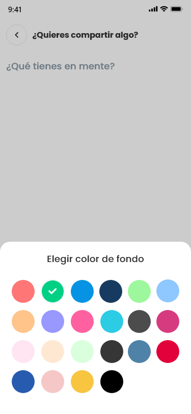

# Sayek

#### Overview

> It is a network of walls based on people's common interests.
> Walls are general themes shared by a group of people who share their content.
> Given that your posts are under a random username and your details are not disclosed.





#### Project Status

* **STATUS:** _Development_ ✔️ | Production | Staging | Deprecated
* **Started by:** [Efra Peralta](https://github.com/Efraa)
* **Local URL:** [http://localhost:3000/](http://localhost:3000/)
* **Prod URL:** [https://sayek.herokuapp.com/](https://sayek.herokuapp.com/)
* **Prod Version:** v0.0.0

#### Prerequisites

The following tools should be installed before starting:

* [Sayek API](https://github.com/Efraa/sayek-api)
* [NodeJS >=10.x.x](https://nodejs.org/)
* [Yarn](https://yarnpkg.com/)

#### Technologies

* [TypeScript](https://www.typescriptlang.org/): Is a typed superset of JavaScript that compiles to plain JavaScript.
* [Styled Components](https://styled-components.com/): are one of the new ways to use CSS in modern JavaScript.
* Others...

#### Quick start

1. Make sure you have all the prerequisites above installed.
2. Clone this repo.
3. Move to the cloned directory.
4. Install deps, run ``` $ yarn install ```
5. Serve, compile and watching ``` $ yarn start ```

#### Contributors

* [Efraa](https://github.com/Efraa)